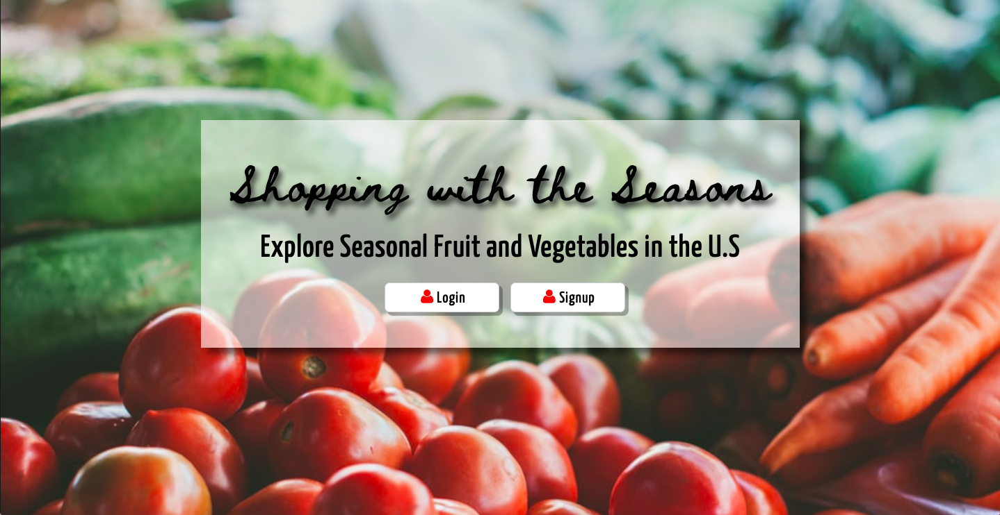

## Goal
Create a fullstack App with User authentification. In this app, users can see what are some produce currently in season, and add them to their shopping cart (they can also delete what they add.)

## How it's made
Made using CSS, Javascript, Node.js, JSON, Express, EJS, MongoDB, and User Authentification using passport.

